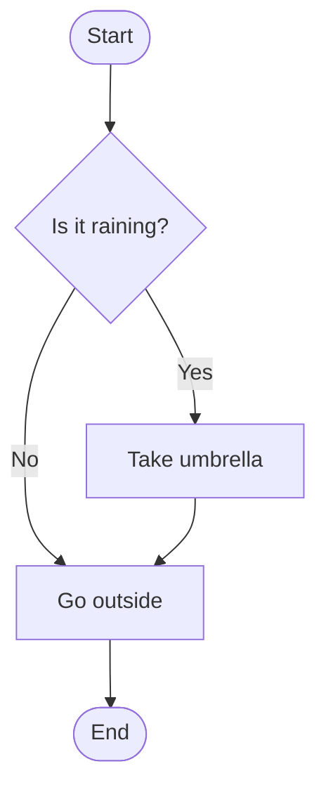
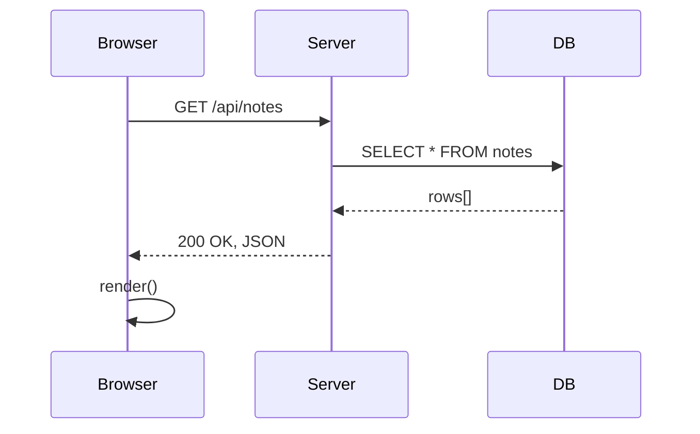
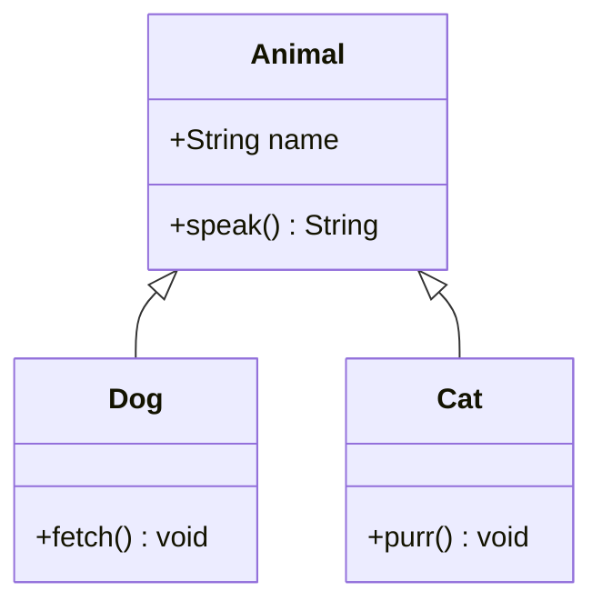
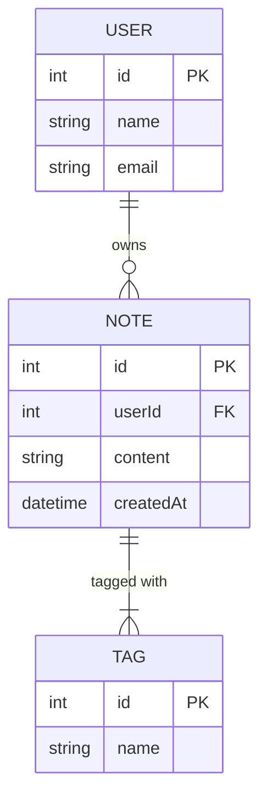
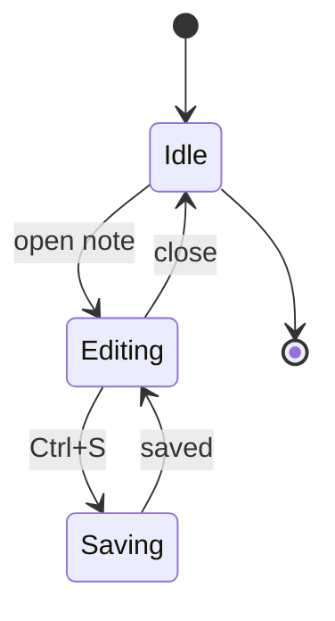
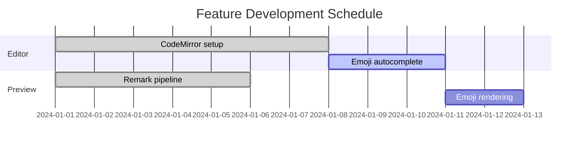
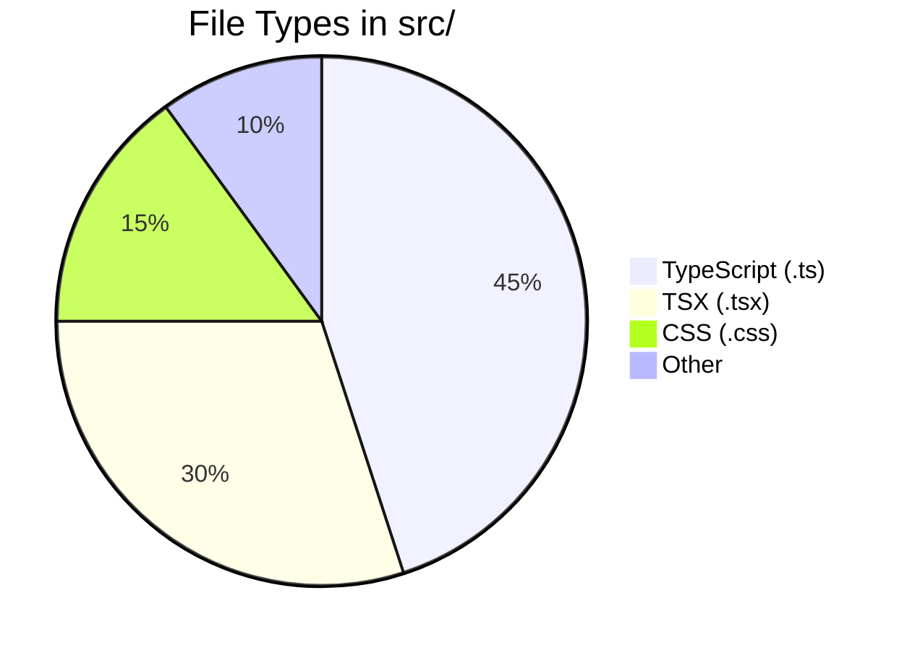
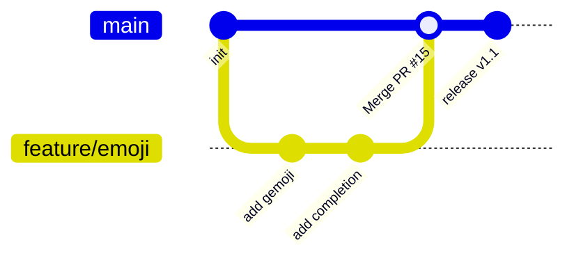
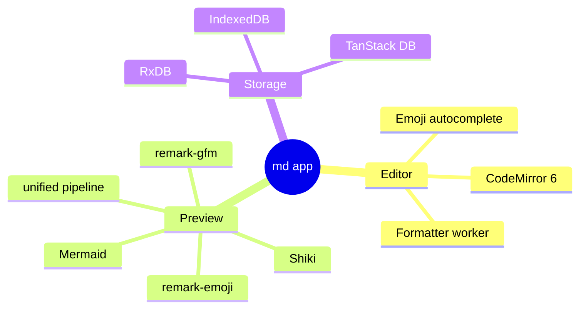

<!-- markdownlint-disable-file MD025 MD028 MD034 -->

# Inline Formatting

## Bold / Italic / Strikethrough

**bold** and _italic_ and _**bold italic**_.
Plain `inline code` between text.
~~strikethrough~~ via remark-gfm.

Text with a hard line break (two trailing spaces):\
second line after hard break.

## Autolinks (GFM)

Bare URL autolink: https://example.com

Email autolink: user@example.com

---

# Links & Images

## Inline Links

[Visit example.com](https://example.com "Example Domain")

Internal-style relative link: [About](/about)

## Reference-Style Links

Full reference — label differs from identifier:

[Visit example.com][example]

Collapsed reference — label equals identifier:

[example.com][]

Shortcut reference — brackets omitted:

[example.com]

Inline elements inside a reference link:

[**bold** and _italic_ inside a reference][example]

<!-- markdownlint-disable-next-line MD052 -->
Undefined reference (rendered as plain text): [broken][no-such-def]

[example]: https://example.com "Example Domain"
[example.com]: https://example.com

## Images

Inline image syntax with alt text and title:


## Reference-Style Images

Full reference with title:

![Placeholder image][placeholder]

Collapsed reference:

![placeholder][]

Multiple images sharing the same definition (both open the same URL in the lightbox):

![First use][placeholder]
![Second use][placeholder]

<!-- markdownlint-disable-next-line MD052 -->
Undefined image reference (renders nothing): ![missing][no-such-img]

[placeholder]: https://placehold.jp/320x120.png "Placeholder image"

## embeds

https://youtu.be/dQw4w9WgXcQ?si=McjhRpMH8py7KxvW

https://www.youtube.com/watch?v=dQw4w9WgXcQ

https://www.youtube.com/shorts/Y0UjGkbnouA

https://youtube.com/shorts/Y0UjGkbnouA?si=iOTAJqDiz5HcsbDA

https://x.com/jack/status/20?s=20

https://open.spotify.com/intl-ja/track/4mAQIBAQKHiZcTCPRJZOcI?si=2005ded583124618

https://open.spotify.com/intl-ja/artist/4UNEM59pyyoeOZiQKj3fXo?si=8DtDq0JMSEycFic5ED78-Q

https://open.spotify.com/playlist/37i9dQZF1DX6f5fW2F9JIU?si=5b97acdf0f914119

https://open.spotify.com/intl-ja/album/75ckWWxu858rtdJZNyfGJI?si=qhnC0RcKS3qNZT0yfwkkRQ

https://open.spotify.com/show/31eYyJk4EPoivEIZqyPzT1?si=dd6e9105036644f9

https://open.spotify.com/episode/5MEVNX2jBdMowWZ6q2BQXV?si=46b485e15ba94cf4

https://soundcloud.com/baron1_3/wonderland?si=51abdcdaaf314493840c65880947b0b3&utm_source=clipboard&utm_medium=text&utm_campaign=social_sharing

https://www.nicovideo.jp/watch/sm9

---

# Code Blocks

## TypeScript

```typescript
interface User {
  id: number;
  name: string;
  email?: string;
}

async function fetchUser(id: number): Promise<User> {
  const res = await fetch(`/api/users/${id}`);
  if (!res.ok) throw new Error(`HTTP ${res.status}`);
  return res.json() as Promise<User>;
}
```

## JavaScript

```javascript
const greet = (name = "world") => `Hello, ${name}!`;

setTimeout(() => {
  console.log(greet("Alice"));
}, 1000);
```

## Python

```python
from dataclasses import dataclass

@dataclass
class Point:
    x: float
    y: float

    def distance(self, other: "Point") -> float:
        return ((self.x - other.x) ** 2 + (self.y - other.y) ** 2) ** 0.5

p1, p2 = Point(0, 0), Point(3, 4)
print(p1.distance(p2))  # 5.0
```

## Go

<!-- markdownlint-disable MD010 -->
```go
package main

import (
	"fmt"
	"sync"
)

func main() {
	var wg sync.WaitGroup
	ch := make(chan int, 5)

	for i := range 5 {
		wg.Add(1)
		go func(n int) {
			defer wg.Done()
			ch <- n * n
		}(i)
	}

	go func() {
		wg.Wait()
		close(ch)
	}()

	for v := range ch {
		fmt.Println(v)
	}
}
```
<!-- markdownlint-enable MD010 -->

## Vue

```vue
<script setup lang="ts">
import { ref, computed } from "vue";

const count = ref(0);
const doubled = computed(() => count.value * 2);
</script>

<template>
  <button @click="count++">Count: {{ count }} (×2 = {{ doubled }})</button>
</template>
```

## HTML

```html
<!doctype html>
<html lang="ja">
  <head>
    <meta charset="UTF-8" />
    <title>Sample</title>
  </head>
  <body>
    <h1>Hello</h1>
    <p>This is a <strong>test</strong> page.</p>
  </body>
</html>
```

## CSS

```css
:root {
  --color-accent: oklch(60% 0.2 250);
}

.button {
  display: inline-flex;
  align-items: center;
  gap: 0.5rem;
  padding: 0.5rem 1rem;
  border-radius: 0.375rem;
  background-color: var(--color-accent);
  color: white;
  font-weight: 600;
  transition: opacity 150ms ease;

  &:hover {
    opacity: 0.85;
  }
}
```

## JSON

```json
{
  "name": "md",
  "version": "0.0.0",
  "scripts": {
    "dev": "vp dev",
    "build": "tsc && vp build"
  },
  "dependencies": {
    "solid-js": "^1.9.12",
    "gemoji": "^8.1.0"
  }
}
```

## Markdown (nested highlight)

````markdown
# Heading inside a code block

```ts
const x: number = 42;
```
````

## Unknown Language (falls back to plaintext)

```brainfuck
++++++++[>++++[>++>+++>+++>+<<<<-]>+>+>->>+[<]<-]>>.>---.+++++++..+++.>>.<-.<.+++.------.--------.>>+.>++.
```

---

# Mermaid Diagrams

## Flowchart



## Sequence Diagram



## Class Diagram



## ER Diagram



## State Diagram



## Gantt Chart



## Pie Chart



## Git Graph



## Mindmap



---

# Lists

## Unordered List

- Alpha
- Beta
  - Beta-1
  - Beta-2
    - Beta-2-a
- Gamma

## Ordered List

1. First item
2. Second item
   1. Nested 2-1
   2. Nested 2-2
3. Third item

## Task List (GFM)

- [x] Set up RxDB schema
- [x] Implement editor with CodeMirror
- [x] Add emoji autocomplete :sparkles:
- [ ] Add tag-based filtering
- [ ] Publish as PWA

## Loose List (with paragraph spacing)

- First item

  This paragraph is inside the first list item.

- Second item

  Another paragraph here.

---

# Tables (GFM)

| Plugin                    | Purpose                                      | Status |
| ------------------------- | -------------------------------------------- | :----: |
| remark-parse              | Parse markdown to AST                        |   ✅   |
| remark-frontmatter        | YAML frontmatter                             |   ✅   |
| remark-gfm                | Tables, task lists, strikethrough, autolinks |   ✅   |
| remark-emoji              | `:shortcode:` → emoji                        |   ✅   |
| remark-footnote-back-link | ↩ back-links on footnotes                    |   ✅   |

| Left-aligned | Center-aligned | Right-aligned |
| :----------- | :------------: | ------------: |
| Apple        |       🍎       |         $1.00 |
| Banana       |       🍌       |         $0.50 |
| Cherry       |       🍒       |         $2.50 |

---

# Blockquotes

> Single-level blockquote.
> Continues on the next line.

> **Nested blockquotes:**
>
>> Inner quote level 2.
>>
>>> Innermost level 3.

> [!NOTE]
> This is a GitHub-style alert blockquote. It is rendered as a plain blockquote
> in this app (no special alert styling), which is expected behavior.

---

# Emoji Shortcodes

Emoji inserted via `:shortcode:` syntax (rendered by `remark-emoji`):

| Input        | Output     |
| ------------ | ---------- |
| `:smile:`    | :smile:    |
| `:+1:`       | :+1:       |
| `:tada:`     | :tada:     |
| `:fire:`     | :fire:     |
| `:sparkles:` | :sparkles: |
| `:heart:`    | :heart:    |
| `:thinking:` | :thinking: |
| `:warning:`  | :warning:  |
| `:rocket:`   | :rocket:   |

Emoji mixed into prose: Great job! :clap: Keep up the good work :muscle: — you're on :fire:!

Unknown shortcode stays as-is: :this_does_not_exist:

---

# Mathematical Notation

Inline math: Euler's identity is $e^{i\pi} + 1 = 0$.

Block math:
$$
\int_{-\infty}^\infty e^{-x^2} dx = \sqrt{\pi}
$$

---

# Footnotes

Footnotes are parsed by `remark-gfm`[^gfm] and back-links are added by the
custom `remarkFootnoteBackLink` plugin[^fn-backlink].

Here is a sentence with multiple footnote references[^multi-1] and
another[^multi-2] to verify that each back-link navigates to the correct anchor.

[^gfm]: **remark-gfm** adds GitHub Flavored Markdown extensions: tables, task
    lists, strikethrough, autolinks, and footnotes.

[^fn-backlink]: The `remarkFootnoteBackLink` plugin walks the AST after
    `remark-gfm` and appends a `footnote-back-link` node (rendered as ↩) to the
    last paragraph of every footnote definition.

[^multi-1]: First of two closely placed footnotes.

[^multi-2]: Second of two closely placed footnotes.

---

# Other Edge Cases

## Code Block without Language

<!-- markdownlint-disable-next-line MD040 -->
```
No language specified — rendered as plaintext without syntax highlighting.
SELECT id, name FROM users WHERE active = 1;
```

## Very Long Inline Code

`const veryLongVariableName = someFunction(argumentOne, argumentTwo, argumentThree, argumentFour);`

## Inline Code with Backtick Inside

Use `` `backtick` `` inside inline code by doubling the delimiters.

## Deeply Nested List

- Level 1
  - Level 2
    - Level 3
      - Level 4
        - Level 5

## Mixed Inline Formats

_**~~`bold italic strikethrough code`~~**_ — all four combined.

## Escaped Characters

\*not italic\* \`not code\` \[not a link\]

---

<!-- markdownlint-disable -->

# Formatter Test (Intentionally Malformed)

> This section is **deliberately mis-formatted**.
> Apply the formatter (the format keybind) and verify each transformation described below.

## 1. Setext Headings → ATX

The following two headings use the underline (setext) style.
Both should be converted to `#` / `##` ATX style.

Setext H1 — converted to `# …`
================================

Setext H2 — converted to `## …`
---------------------------------

## 2. Empty Blockquote → Removed

The lone `>` below is an empty blockquote and will be deleted entirely.

>

Text after the empty blockquote (should remain).

## 3. Multiple Consecutive Blank Lines → Single Blank Line

There are three blank lines between the sentences below.
They will be compressed to one.


Third line after three blank lines.

And here are four blank lines before this sentence.


This sentence was preceded by four blank lines.

## 4.  Double Space After `#` → Single Space

The heading below has two spaces after `##` — normalised to one.

##  Heading with double space (normalised to single)

###   Heading with triple space (normalised to single)

## 5. Over-Indented Nested List → 2-Space Indentation

List items indented with 3 spaces instead of the required 2.
The nested items will be re-indented to align at 2 spaces.

- Level 1
   - Level 2 — 3-space indent (becomes 2)
      - Level 3 — 6-space indent (becomes 4)
   - Another level 2

## 6. Thematic Break Style → `---`

`***` and `___` are both normalised to `---`.

***

___

## 7. Table Column Width → Padded and Aligned

Columns with inconsistent padding are aligned automatically.

| col A | col B | col C |
|---|---|---|
| short | a much longer cell value | x |
| hi | world | yes indeed |
